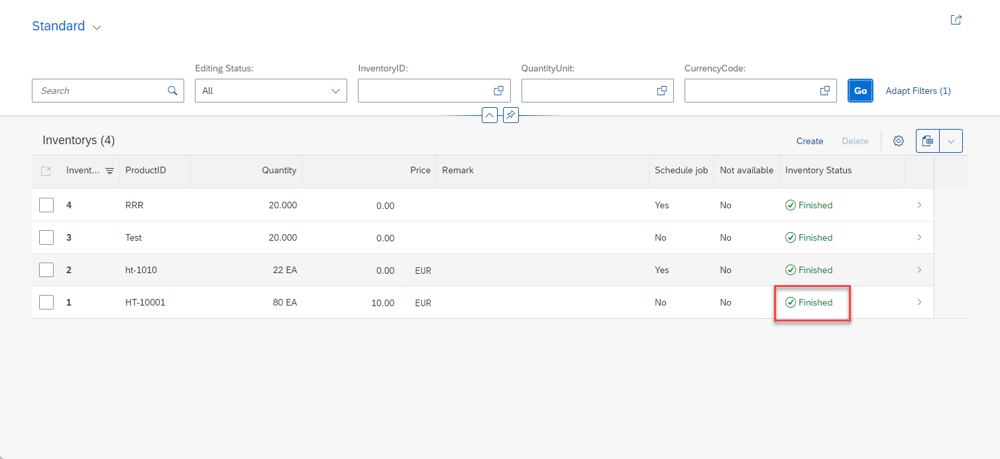
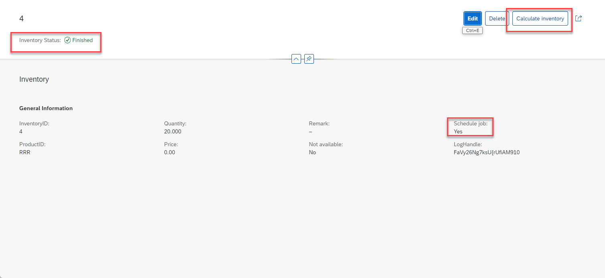

# How to schedule application jobs from a RAP-based business object

<!--- Register repository https://api.reuse.software/register, then add REUSE badge:

-->

## Description

### Introduction

In this repository you will find the implementation of a simple RAP business object that allows to schedule a class as an application job that takes the semantic key of the selected entity as a paramter. This way it is possible to perform a long running calculation (the determination of inventory data) for a specific inventory id.  
It will especially shown how this class can also be run interactively thereby allowing the developer to debug the implementation which is not possible when the code is executed in the background as an application job.  
In addition you will find working sample code that allows you to start an application job via an action of the RAP business object and what needs to be implemented to display the job status in nice way in the Fiori UI using virtual fields that always reflect the current status highlighting the criticality (aborted, running, finished and others statuses) and the job status text in the Fioir list report.
The package comes with a setup class that uses the released application APIs to create the application log object, the job catalog entry, and the job template.  
This means that after having imported this Git repository, having activated the objects, having published the service binding, and after having executed the setup class, you can try out my implementation immediately.

List page

 
 
 Object page   
 
      

### Coding explained

#### Implementing the class that runs as an application job

A class that can be started as an application job must implement the following two interfaces: 
- if_apj_rt_exec_object~execute
- if_apj_dt_exec_object~get_parameters
Both interfaces come with only one method _execute( )_ and _get_parameters( )_ that must be implemented each.  
In addition we used the interface _IF_OO_ADT_CLASSRUN_ which allows you to run it interactively using the _main()_ method. 
Alternatively the code will write the output to the application log.

##### add_text_to_app_log_or_console( )
This method takes a character string of length 200 as a parameter which is either sent to the console window or written to the application log depending on whether the class has been started interactively via pressing F9 or whether it has been scheduled as a background job so that the method _execute( )_ will be called.

##### if_oo_adt_classrun~main( )
The interface _if_oo_adt_classrun_ is used to make the live of the developer easier when implementing the business logic. This is because it allows to run the class interactively when pressing F9. 
Within our main( ) method the execute( ) method is called and certain default values are passed. The output via the out object is wrapped in the method add_text_to_app_log_or_console( ) which either writes the string that it passed to the console window or to the application log depending on whether the class has been started to run interactively via F9 or whether it has been scheduled application job in the background. 

##### if_apj_rt_exec_object~execute( )
This method is actually called when the application job is started by the framework. Parameters can either be passed when using the released application job scheduling API directly or by selecting an appropriate application job template or as a fallback by running the method if_apj_dt_exec_object~get_parameters( ) that returns the type of parameters alongside with default values if returning such default values have been implemented.

##### if_apj_dt_exec_object~get_parameters( )
This method plays a similar part as the select option part of classic ABAP report. It defines on the one hand which parameters are expected by our class as parameters and it allows the developer to define certain default values that are being returned if no data is passed when the job has been scheduled.

#### application log, job catalog entry and jop template

In order to schedule our class as an application job we have to create a job catalog entry and a job template.
And to be able to write the output of your class to ab application log we also have to create an application log object if there is no existing application log object that shall be reused.  
All three objects are being created by the setup class **zapp_cl_demo_01_setup**.   
Alternatively it is possible to create those objects manually using the appropriate json based editors.  
After an application job has been started an after it has been scheduled the job status and the job log can be checked using the administrative job scheduling app.  
(it has to be checked why a developer can run the application jobs of the RAP generator)

#### RAP business object   

So far it is only possible to call the job scheduling API ``CL_APJ_RT_API=>SCHEDULE_JOB`` within the additional save phase. As a result the **jobname** and **jobcount** are only available in the additional save phase but not in the interaction phase. As a result one has to update the table of the business object with these values during the additional save phase. However, at this point in time the business data cannot be changed anymore.   

When the job scheduling API would be called already during the interaction phase the problem can occur that implicit database commits are triggered. An example would be a remote API call or triggering the action to save draft data. Afterwards it would still be possible that a validation fails so that the business object still resides in an inconsistent state. However because of the implicit database commits mentioned above the application job would have been scheduled.

In an upcoming version of the job scheduling API it will thus be possible to generate a valid jobname and jobcount beforehand. 

The jobname and jobcount that are retrieved using this API call can then during the interaction phase be stored into the transaction buffer of your business object. The data can then later be used to call the job scheduling API ``CL_APJ_RT_API=>SCHEDULE_JOB`` within the additional save phase.

##### Start the application job via an action

When executing the action ``calculateInventory`` the flag ``ScheduleJob`` is set in the transactional buffer that an application job should be scheduled.

<pre>

   LOOP AT inventories INTO DATA(inventory).
      CLEAR update_line.
      update_line-%key = inventory-%key.
      update_line-ScheduleJob =  abap_true.
      APPEND update_line TO update.
    ENDLOOP.

    MODIFY ENTITIES OF ZAPPR_InventoryTP_01 IN LOCAL MODE
         ENTITY Inventory
           UPDATE FIELDS (
                          ScheduleJob
                          ) WITH update
        REPORTED reported
        FAILED failed
        MAPPED mapped.

</pre>

When the validations have been successfull and the save sequence is reached the code checks if the ``ScheduleJob`` flag is set. If yes the job is scheduled and the return parameters ``jobname`` and ``jobcount`` are stored into the database table ``zapp_inven_01`` of our RAP business object.

<pre>

    LOOP AT update-inventory INTO DATA(update_inventory)
            WHERE ScheduleJob = abap_true AND
                  %control-ScheduleJob = if_abap_behv=>mk-on.

      TRY.

          job_start_info-start_immediately = abap_true.

          job_parameter-name = zapp_cl_demo_01=>selection_name . "'INVENT'.
          range_value-sign = 'I'.
          range_value-option = 'EQ'.
          range_value-low = update_inventory-uuid.
          APPEND range_value TO job_parameter-t_value.
          APPEND job_parameter TO job_parameters.

          cl_apj_rt_api=>schedule_job(
              EXPORTING
              iv_job_template_name = job_template_name
              iv_job_text = |Calculate inventory of { update_inventory-ProductID }|
              is_start_info = job_start_info
              it_job_parameter_value = job_parameters
              IMPORTING
              ev_jobname  = job_name
              ev_jobcount = job_count
              ).

          UPDATE zapp_inven_01 SET job_count = @job_count , job_name = @job_name WHERE uuid = @update_inventory-uuid.

   CATCH cx_apj_rt INTO DATA(job_scheduling_error).
   
   " some error handling
   
   ENDTRY.

</pre>

##### Display the job status via virtual elements

Since the values ``jobname`` and ``jobcount`` have been persisted in the database table it is possible to display the status of application job using virtual fields. 
These fields contain the job status (for example **'F'** for finished) and the appropriate text. In addition the criticality is calculated and used to show the text in the appropriate colours. (green for finished, red for aborted and orange for running).  

<pre>
 IF <fs_original_data>-jobname IS NOT INITIAL AND <fs_original_data>-jobcount IS NOT INITIAL.

            cl_apj_rt_api=>get_job_status(
              EXPORTING
                iv_jobname  = <fs_original_data>-JobName
                iv_jobcount = <fs_original_data>-JobCount
              IMPORTING
                ev_job_status = JobStatus
                ev_job_status_text = jobstatustext
              ).

            <fs_original_data>-JobStatus = jobstatus.
            <fs_original_data>-JobStatusText = jobstatustext.

            CASE jobstatus.
              WHEN 'F'. "Finished
                <fs_original_data>-JobStatusCriticality = 3.
              WHEN 'A'. "Aborted
                <fs_original_data>-JobStatusCriticality = 1.
              WHEN 'R'. "Running
                <fs_original_data>-JobStatusCriticality = 2.
              WHEN OTHERS.
                <fs_original_data>-JobStatusCriticality = 0.
            ENDCASE.

          ENDIF.

</pre>

## Requirements

- ABAP Platform 2021 and higher  
- SAP BTP, ABAP Environment  
- SAP S/4HANA, ABAP Environment  

## Download and Installation

- Create a package, e.g. Z_DEMO_APPL_JOBS 
- Link the URL of this repo with the package that you have created beforehand
- Pull the content of this repository
- Activate all changes
- Run the setup class ``zapp_cl_demo_01_setup``  
- Publish the service bindings ``ZAPPUI_INVENTORY_O4_01`` or ``ZAPPUI_INVENTORY_O2_01``   

## Known Issues
<!-- You may simply state "No known issues. -->

## How to obtain support
[Create an issue](https://github.com/SAP-samples/<repository-name>/issues) in this repository if you find a bug or have questions about the content.
 
For additional support, [ask a question in SAP Community](https://answers.sap.com/questions/ask.html).

## Contributing
If you wish to contribute code, offer fixes or improvements, please send a pull request. Due to legal reasons, contributors will be asked to accept a DCO when they create the first pull request to this project. This happens in an automated fashion during the submission process. SAP uses [the standard DCO text of the Linux Foundation](https://developercertificate.org/).

## License
Copyright (c) 2022 SAP SE or an SAP affiliate company. All rights reserved. This project is licensed under the Apache Software License, version 2.0 except as noted otherwise in the [LICENSE](LICENSE) file.
